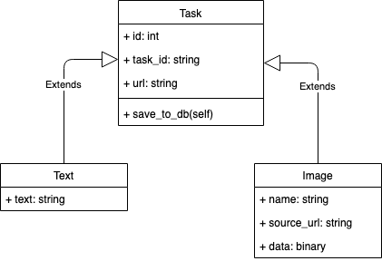

# Semantive Downloader

Mikroserwis zajmujacy sie gromadzeniem i udostępnianiem informacji pobranych z sieci.  
Jego zadaniem jest pobieranie testku oraz obrazów z róznych stron internetowych.

## Główne Funkcjonalności

- Pobranie tesktu z danej strony internetowej i zapis jej w systemie
- Pobranie wszystkich obrazków z danej strony i zapis ich w systemie.
- Sprawdzenie statusu zleconego zadania.
- Możliwość pobrania stworzonych zasobów (tekstu i obrazków).

## Model UML

## Start / Stop Aplikacji

## Uzytkowanie

## Testowanie